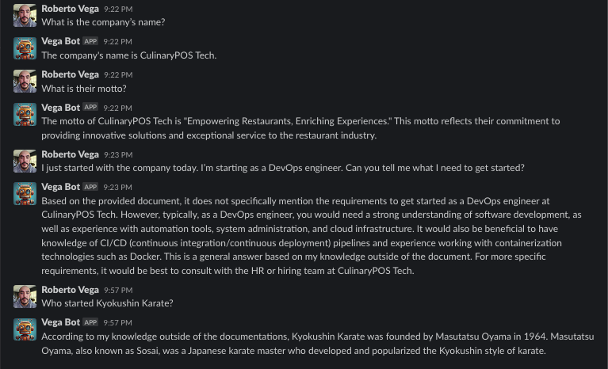
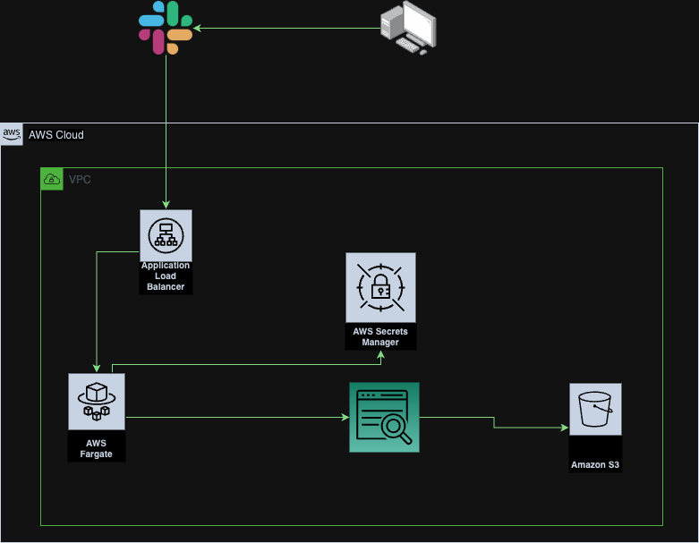
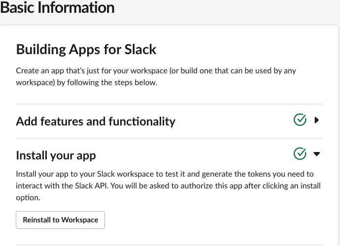
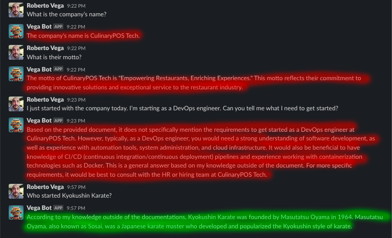

# SlackOpenAI

This is a [Slack chat bot](https://api.slack.com) that integrates with [OpenAI](https://openai.com/) and [Amazon Kendra](https://aws.amazon.com/pm/kendra/).

This was the first Python project I have ever done in about five years, so please excuse the mess. If you have any suggestions, please feel free to open an issue or a pull request.

I decided to share this project because I had a hard time finding any free/open source Slack bots that integrated with OpenAI and Kendra. I hope this helps someone else out there.

If you find this useful, please consider [buying me a coffee](https://www.buymeacoffee.com/devrvega).

---

## Example

---

## To Do

- [ ] Refactor to use [Slack Bolt](https://slack.dev/bolt-python/tutorial/getting-started)
- [ ] Add AWS CDK for infrastructure for easier deployment

---

## Useage

### Prerequisites
- Slack Workspace
- OpenAI account with API key
- AWS account

### Infrastructure

- The application is accessed through an internet facing [Application Load Balancer](https://aws.amazon.com/elasticloadbalancing/application-load-balancer/).
- The application itself is hosted within [ECS Fargate](https://aws.amazon.com/fargate/) using ARM64 architechture.
- AWS (Secrets Manager)[https://aws.amazon.com/secrets-manager/] is used to store the Slack API token, the OpenAI API token, as well as the Kendra Index (See bot.py for the variable names).
- [Kendra](https://aws.amazon.com/pm/kendra/) is used to provide the search functionality with data.

For my use case, I used [AWS S3](https://aws.amazon.com/s3/) to store the data that was being indexed by Kendra.

Here is a diagram of my architecture:

**Note**: The other things not listed are the VPC, Subnets, and Security Groups.

### Application

- The application is written in Python 3.9.
    - Requirements.txt is included for the dependencies.
- The application is deployed using Docker.
    - Dockerfile is included.
    - The application listens on port 8000 using [Gunicorn](https://gunicorn.org/).
    - The application is configured for 4 workers.
    - These settings can be changed in the Dockerfile.

### Slack

- You will need a Slack workspace.
- You will need access to create a Slack app.
- [Quick Start Guide](https://api.slack.com/start/quickstart) for Slack apps.

Hopefully I can make a guide on Medium with more detailed instructions.

---

## Deployment

### AWS

**Note**: This is only going to cover the installation process for the application that I have for AWS account and my specific use case. A few steps may vary depending on your AWS account and your use case. The entire process below is done in an automated process via GitHub Actions. The workflow file is included in this repo.

The image is built pushed to my ECR Repository. I create a new tag for the image bsed on the last four of the commit SHA in case I need to roll back for any reason. There is a new task definition created tied to that image tag. I then update the service in ECS to the new task definition with that new tag.

If you've already created your Slack App, then you can skip to the next section, and start communicating with your bot.

### Slack

If you've followed the Quick Start Guide, then you should have a Slack app created. You will need to add the following scopes to your app:
- chat:write
- im:history
- im:read
- im:write

You can find the scopes under the "OAuth & Permissions" section of your app.

Next, go to the "Event Subscriptions" section of your app. You will need to enable events. The URL will be the URL of your load balancer. Once that's been verified, set it to subscribe to the following events:
- message.im

You will need to install/reinstall your app to your workspace. You can do this by going to the "Install App" section of your app's Basic Information page. You will need to reinstall the app to your workspace. Once that's done, you should be able to start communicating with your bot.

Again, I'm hoping to get a more detailed step by step guide together on Medium.

---

## Using the Bot

All you would need to do is just send a message directly to the bot. If everything has been deployed and configured correct, it should respond back to you. The bot is configured in a way that it would search its documentations first, and if it can't find anything, it will then use the OpenAI Model you've configured for a response. So, some of these responses may not be the most accurate depending on what model you're using. Going over the example I posted at the beginning of this README, I've highlighted the different responses. The messages highlighted in red were pull from its documentation. The message highlighted in green were generated by the OpenAI Model.

---

 
<strong>Buy me a Coffee</strong>  

